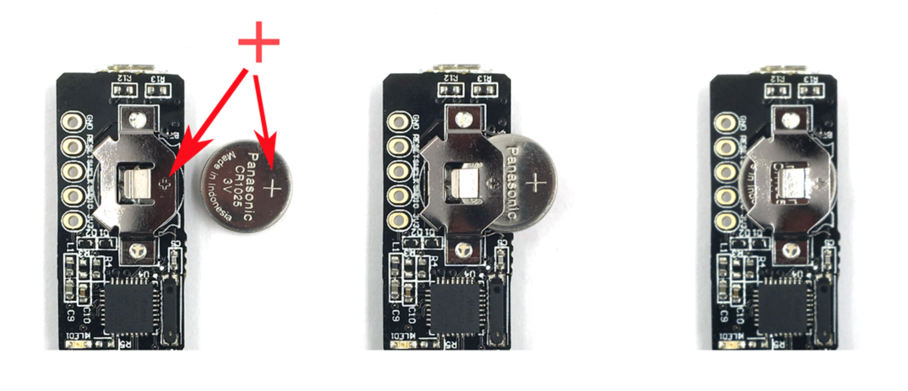
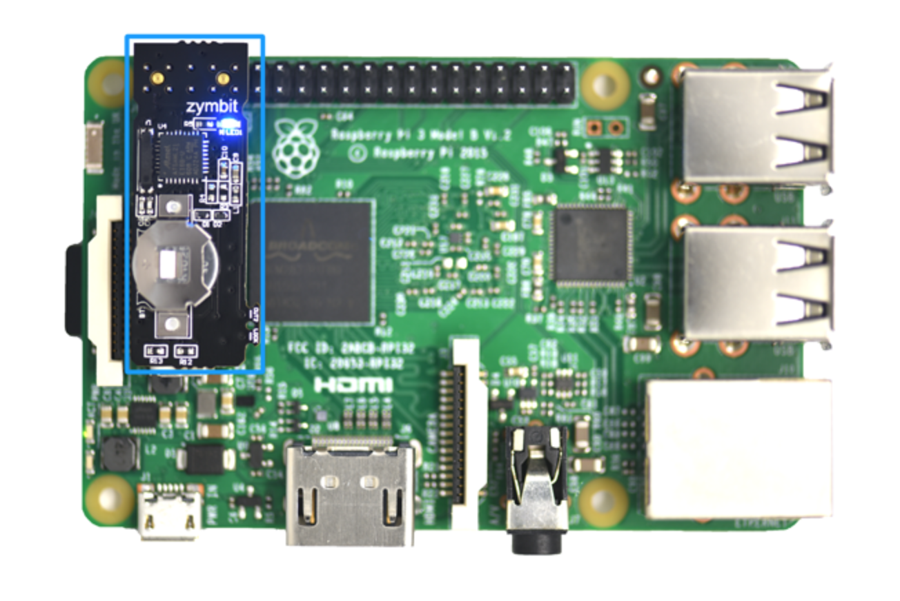
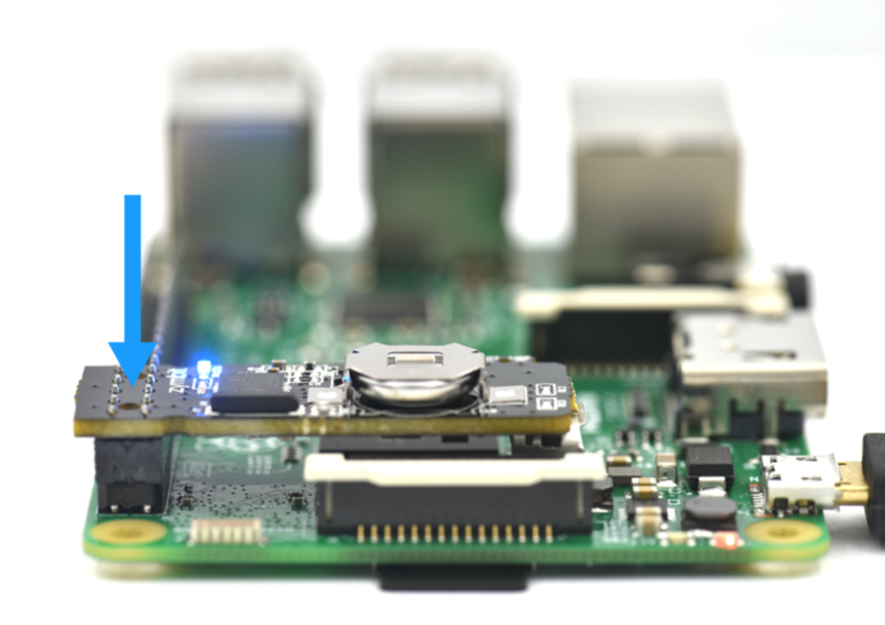

ZYMKEY4i is the fourth generation of the Zymbit security module designed specifically to work with Raspberry Pi and NVIDIA Jetson. It connects to the GPIO header of the SBC and uses the  bus and `GPIO4` to communicate with the SBC CPU via an encrypted channel.

In this *Getting Started* guide we describe how to install your Zymkey4i to a Raspberry Pi running Raspbian or Ubuntu. The installation process is the same for both of these Linux distributions.

<!-- TODO: Update link -->
<!-- **[Learn about Linux OS support for Zymkey.](https://community.zymbit.com/c/operating-system/23)** -->

The Zymkey occupies 10 pins on the GPIO header. It can also be used with other GPIO devices attached, or other  devices attached. The correct address range and use of IO pins will be described in this guide as well.

<!-- TODO: Make a shortcode that can style things like this more consistent between cards. -->

{}

{}
{}
 bus with the default address of `0x30`."
    >}}
{}


### Summary of Setup Steps

<!-- TODO: Add better styling for definition lists in this theme. -->
Installing the hardware
:   Install the battery on the Zymkey4, and connect it to the host single-board computer (SBC).

Establish an  connection
:   Enable the  bus on the host device in order to be able to communicate with the Zymkey.

Install the client software
:   These utilities provided by Zymbit are necessary to interact with the hardware module.

Test the installation
:   Your Zymkey is now temporarily bound to your SBC and ready for use in developer mode.

## Installing the hardware

### Battery Installation


Battery installation is not required for the Zymkey4 to function, but it is highly recommended if your device is vulnerable to physical access!


To maintain the real-time clock (RTC) and tamper detection features in the event of power loss, install a **high quality** 3V `CR1025` coincell battery in the Zymkey4's battery slot with `+ve` **facing upward**.

<!-- Link to resource about battery installation and purpose -->

### Hardware Installation


Installing your hardware correctly is important to avoid destroying your SBC or Zymkey. Be sure to follow the instructions below carefully. In particular:

* Pay close attention to the images below to ensure the SBC's GPIO pins are **properly aligned** with the Zymkey4i's header.
* Ensure that your **Raspberry Pi is powered down** before proceeding.
* Ensure that the coincell battery (if installed) is installed with the positive side (marked with `+`) facing upward.


#### Before installing

Power off your Raspberry Pi and disconnecting it from power entirely to ensure that neither the SBC or the Zymkey4i are damaged.

#### Attach hardware

Hold the Zymkey4i with the LED and battery holder facing upward. Then, carefully align the Zymkey's connector with the first 10 GPIO pins of the Raspberry Pi.

Press down firmly on the Zymkey to connect it to the GPIO pins of the Raspberry Pi. The Zymkey should fit relatively snug and maintain a tight interference fit around the pins.

The Zymkey occupies 10 pins on the GPIO header. If the header of the Zymkey isn't properly aligned with the GPIO header of the Raspberry Pi, both devices could be damaged.


The default configuration uses GPIO4. This can be reconfigured to use another GPIO of your choice.


#### Power on and confirm operation

After you have connected the hardware and are sure that the pins are properly aligned, power up your Raspberry Pi. You should see a blue LED blinking rapidly and consistently (5 blinks per second). This confirms that your Zymkey is operation but unconfigured.

If the blue LED blinks erractically, or not at all, then there is an installation error and you should check the connections.


Power quality matters to the reliable and secure operation of your system and Zymkey.


## Establish an I2C connection

For Raspian-based operating systems, you must configure the state of the .

0. Log in to your Raspberry Pi and run `sudo raspi-config`.
0. Navigate to `Interfacing Options` -> `I2C` -> `Would you like the ARM I2C interface to be enabled?`
0. Select yes, and confirm this choice.

Your  bus is now configured and ready to talk to the Zymkey. The default  address for the Zymkey is `0x30`.


The default I2C address for Zymkey is 0x30. If this conflicts with another device in your system, you can reconfigure the Zymkey to use another address of your choice.


{}
The default mode for the cpu scaling governor is ondemand. There have been some issues with the interaction between the zymkey and the I2C bus, when the governor is set to ondemand. We highly recommend to switching the governor to performance to get the most out of the zymkey.


How to set cpu governor to performance.


{}

## Install the client software

Login to your host device and follow these steps to install the Zymkey's client software.

The Zymkey will require a number of packages to be installed from the Raspbian and Zymbit `apt` repositories. The following setup script will be install a number of files and software packages on your system, including:

* Zymbit `.service` files located in the `/etc/systemd/system` directory
* `pip`

Ensure that `curl` is installed on your host:

`sudo apt install curl`

Download and install the necessary Zymbit services onto your device.

`curl -G https://s3.amazonaws.com/zk-sw-repo/install_zk_sw.sh | sudo bash`

Then, grab a cup of coffee, because this will take between 4 and 20 minutes.

## Test the installation

When the software installation has completed, reboot your device. After the reboot has completed, the Raspberry Pi will perform an operation that will temporarily bind the Zymkey to your SBC. Once the Zymkey is bound to the SBC, the Zymkey's blue LED should blink slowly--once every 3 seconds--to indicate that the binding is complete.


In production mode, Zymkey generates a unique Device ID by measuring certain attributes of the specific host and the Zymkey itself to permanently associate the two.


The quickest way to get started is to see the Zymkey's various features at work by running these test scripts that were installed with the client software:

* `python3 /usr/local/share/zymkey/examples/zk_app_utils_test.py`
* `python3 /usr/local/share/zymkey/examples/zk_crypto_test.py`

Now you're ready to start developing with Zymkey4 and Raspberry Pi. When it's time to deploy your project, read our guide on enabling Production Mode:


To permanently bind the Zymkey to a host board, generates a unique Device ID by measuring certain attributes of the host and the Zymkey itself to associate the two devices.

