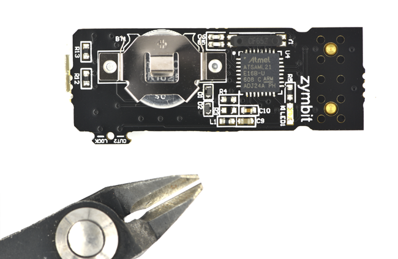
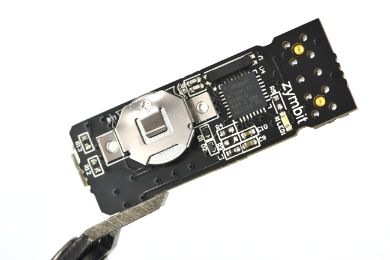
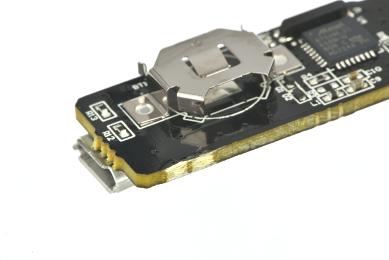


THE BINDING PROCESS IS PERMANENT AND CANNOT BE REVERSED. PAY ATTENTION TO THE FOLLOWING:

* Your specific Zymkey will be **permanently** locked to the specific host device.
* It will be impossible to move or bind your Zymkey to another device. There are no factory resets, masterkeys, or other forms of recovery.
* If you are using the *Perimeter Detect* features, then the sequence in which you arm and disarm this feature is very important. Be sure to carefully follow the process steps below.
* Once you have locked your Zymkey into production mode, Zymbit cannot guarantee its operation if you subsequently do a major distribution upgrade (e.g. Raspbian Jessie to Stretch). [Contact Zymbit for more information.](https://www.zymbit.com/contact-us/)

If you decide that you are not ready for permanent binding, leave the Zymkey in developer mode, but beware this makes it easier for a bad actor to replace the host with rogue hardware.



When you have completed your devlopment work with the Zymkey4 and are ready to deploy your system into the field, we recommend that you permanently bind your Zymkey to a specific host device and SD card.


Zymkey generates a unique Device ID by measuring certain attributes of the specific host and the Zymkey itself to permanently associate the two devices.


### Summary of Steps

Develop your application
:   Ensure your host has all the necessary prerequisites in place to interface with the Zymkey and that it will be able to run your software application.

Active production mode
:   Permanently bind your Zymkey to the host device.

## Develop your application


*DO NOT* cut the lock tab yet.


To begin, ensure that you have followed the Getting Started guide for your Zymkey4 carefully to install the prerequisite client software:


Install your Zymkey4 to a Raspberry Pi running Raspbian or Ubuntu before moving to production mode.


To reiterate, before you continue, the following steps should be complete:

* [ ] Install a battery on the Zymkey.
* [ ] Connect the GPIO header of the Zymkey to the GPIO pins of the host board while the host is powered down.
* [ ] Install Zymkey software on the host and establish temporary binding in development mode.

After these steps have been completed, you are ready to prepare your device for permanent binding.

### Prepare *Perimeter Detect*

The `Perimeter Event Actions` for your Zymkey should be set to `none` or `notify` only. If your Zymkey's action mode is set to `selfdestruct`, you might render your Zymkey useless while attempting to activate production mode.


Understand how to use the Zymkey's perimeter detect features.


To do this quickly, with the Zymkey client libraries installed, you can run the following shell command to use the Python API to communicate with the Zymkey and set the `Perimeter Event Actions` to do nothing when triggered:

```bash
python3 -c "import zymkey;
for ch in (0, 1):
    zymkey.client.set_perimeter_event_actions(ch, action_notify=False, action_self_destruct=False)
zymkey.client.clear_perimeter_detect_info()"
```

### Prepare your application

If you intend to use your Zymkey to encrypt your root file system, you should complete that step now, using our guide. This step is highly recommended.


Encrypt the root file system of your host device using LUKS and your Zymkey.


You should then install your application on your host SBC (in the encrypted volume, if applicable).

### Test, debug, and test again


*DO NOT* skip this step. If you encounter a major issue with your application after your Zymkey has been permanently bound to your device and armed, you may not be able to fix it.


Test the functionality of your application thoroughly to ensure it is free of major defects that will prevent it from functioning properly. After the Zymkey has been bound to your host SBC, especially if *Perimeter Detect* features are in use, it may be difficult to make significant chances to your configuration without locking youself out of the Zymkey, depending on the nature of your application and its configuration.

## Activate production mode


*DO NOT* cut the lock tab yet.


Before proceeding, shut your host board down and disconnect it from power. Then, without removing the Zymkey's battery (if installed), remove the Zymkey from the host SBC.

### Cut the lock tab


This procedure can be performed while the Zymkey is connected to the host SBC, but the host **must be disconnected from power**.

Do not proceed without completing the steps outlined above, including setting the `Perimeter Event Actions` to `none` or `notify`.


Follow the procedure below carefully to move your Zymkey4 into production mode.






Align the pliers with the guide lines on the Cut-2-Lock tab, and carefully cut the tab.




The resulting cut should leave the edge of the Zymkey motherboard flush. If portions of the tab remain attached to the board, you can remove them with the angle cutter pliers.



### Finalize your device for deployment

After cutting the lock tab, reinstall the Zymkey the host SBC, reconnect it to power, and boot into the host. The blink pattern on the Zymkey will change to 3 rapid blinks once every 3 seconds to indicate that Zymkey has bound to the host in production mode.

If you are using the *Perimeter Detect* features, close your perimeter circuits (for example, by closing the enclosure's lid), and then clear any `Perimeter Detect Events` using the API:

```bash
python3 -c "import zymkey; idx = 0;
zymkey.client.clear_perimeter_detect_info()
for p in zymkey.client.get_perimeter_detect_info():
  if p:
    print(f'Channel {idx} has a detected breach event. Clear the Perimeter Detect Events again.')
    idx += 1
  else:
    print('No perimeter breach detected.')"
```

If you get a message that a breach event was detected from the above command, run it again to ensure all events have been cleared. When it confirms that no breach events have been detected, it is then safe to arm the system by setting the `Perimeter Event Actions` to `notify` or `selfdestruct`, if desired.

Your system is now armed and ready to be used in the field!

