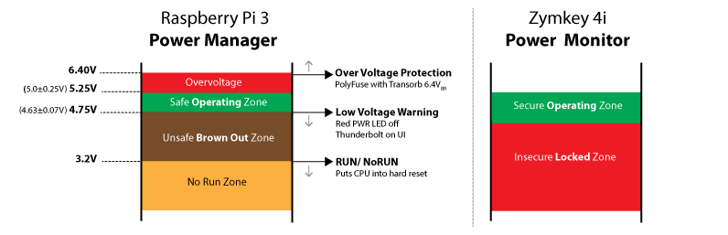

### Applicable Products
The information included in this post applies to all Zymbit security modules.

## Power & Security
Poor power quality can result in unstable and potentially insecure operation of your single board computer (SBC), depending upon it's design, operating conditions and related system and power components. In this post we will outline the important factors of power quality management and explain how Zymkey manages the security of your device when power quality is poor.

----------
## Power Quality Management

Unlike software which is digital, deterministic and repeatable, power is analog and subject to the laws of physics and electrical engineering. Fortunately, with good design and a basic understanding, power quality can also be deterministic and repeatable. We'll use the Raspberry Pi 3 to explain the basic concepts.

### Safe operating zone

The Raspberry Pi 3 is designed to operate of a 5V (nominal) power supply, delivering 2A or more. (more on current rating later). This voltage is widely used in USB and mobile devices, making it easy to buy a power supply (and more on that later).  In reality, power supplies have a tolerance on the output voltage, typically ±5%, which means the output voltage can range from a low of 4.75V to a high of 5.25V.  The Raspberry Pi is designed to operate reliably in this **Safe Operating Zone.**

### Brown out zone - symptoms
If the supply voltage dips below the safe operating zone then this can put the SBC into a less determinstic state - commonly known as "brown out" zone. Symptoms of brown outs range from irritating to catostrophic, depending upon where in the brown zone your SBC is operating:

_Apparently Benign BUT Significant_
* RED PWR LED on RPI 3 is off or flickering
* Power Warning - thunderbolt on console GUI
> **IMPORTANT:  The low voltage warning system is designed to protect your application. Use it !**
It will save you time and money in debugging erratic system behavior and potentially expensive field failures and recalls.

_Erratic Behavior_
* GPIO digital and serial bus signals behave inconsistently
* USB peripherals behave inconsistently

_Catostrophic Failures_
* **Irregular cycling through reset and reboot**, at which time vulnerabilites in the boot sequence or memory write cycles might be exposed (more in a later post).

* **Regular cycling through reset and reboot** - this can happen when your application program calls up more resources that consume more power at regular times. For example turning on additional cores for intense image processing, or turning on a USB peripheral or LCD display.

* SD card failures, corrupted SD card contents

----------

## Why Good Power Design Matters
A well designed SBC will include elements of power management that monitor what is happening to the input power supply using a layer of hardware protection and supervision.  In the case of the Raspberry Pi 3, there is a voltage monitor circuit that triggers a 'Low Voltage Warning' event when the supply voltage dips below 4.63V ±0.07V. This Low Voltage event is used to warn your software application of a potential loss of power  and **perhaps** initiate an orderly shutdown sequence **before a hard reset** of the CPU occurs. If a hard reset does occur it will  literally force the hardware to reset giving no time to store data or program cached in memory. In the case of the Pi, a hardware reset occurs at ~3.2V.

----------
## Secure Power Zone - Zymkey Power Quality Monitor
Zymkey includes a similar power monitoring system although it's purpose is slightly different: it's purpose is to prevent access to cryptographic keys during unstable power conditions (resulting from an intentional power vector attack, or unintentional system failure).

In the event of poor power quality the Zymkey instantaneosly shuts down access to the security API and communication channels and retreats into sleep mode (no sleep mode on Zymkey 4i lite). In sleep mode the Zymkey continues to monitor the quality of the 5V power rail and when conditions have stabilized it reactivates the security API and communicaiton channels.

----------
## Other Considerations

### Static & Dynamic Power Loads
Most power supplies are simply specified in terms of  Voltage and Current Ratings. Better ones will specify the output voltage at different current outputs. The ratings are helpful, but not enough to determine if you have a suitable power supply that will operate reliably over the long term under different system load conditions.

**Real systems** include devices that turn on and off, sometimes quickly (eg LCD switched from black to white, or multiple I/O's turning on simultaneously, or USB powered HDD spining up). In these situations, a device switching on will create a dynamic (quickly changing) load on the power supply which can cause a momentary dip in the voltage as it trys to deliver the required surge current.

Average power supplies often don't have good dynamic load response and can dip momentarilly or intermittently below a recommended operating voltage (4.63V in the case of the RPi). Good quality power supplies have a better dynamic performance and can respond very quickly to changes in loads.

----------
## QUESTIONS?

### Is my power supply good enough ?

> **Don't be in denial**.  Developers unfamiliar with embedded hardware may not have the necessary test equipment or experience to determine the quality of their power supply. But denying there might be a problem does not make it go away! So here are a few tips when checking power quality:

* A standard multimeter will NOT give you a good indication of power quality: most take average readings that filter out (not see) any potentially harmful transients or AC components.

* Monitor the power rail with an oscilloscope, during static and dynamic loads that you would expect to see when your product is deployed.

* Thankfully the designers of Raspberry Pi have provided two very helpful diagnostic tools: A Red Power LED and a Low_Pwr warning symbol (thunderbolt icon) on the user display.

>If the Red Power LED is not illuminated this means the supply voltage is inadequate, falling below 4.63V. (The newer Pi(s) have a well engineered power circuit, and may continue to function even if the input voltage is below spec; the same may not be true of peripherals). The GUI had an rainbow indicator (replaced by a lightning bolt) which comes up in the top right if the voltage is inadequate. This has a 3 second timer, and may display even if the LED appears to be lit.
Check out the [Raspberry Pi Stack Exchange](https://raspberrypi.stackexchange.com/questions/51615/raspberry-pi-power-limitations/51616#51616) for a more complete description of the Pi power system.

----------
### Can I disable Zymkey power quality monitor?

No, not for standard products. This is an intentional design feature that protects the security of your critical keys and intraboard communications. If your system requires a different behaviour then please [Contact Zymbit engineering services.](https://zymbit.com/contact-form/)

----------

## Useful References

* [Raspberry Pi 3 schematic with power supply details](https://www.raspberrypi.org/documentation/hardware/raspberrypi/schematics/Raspberry-Pi-3B-V1.2-Schematics.pdf)
