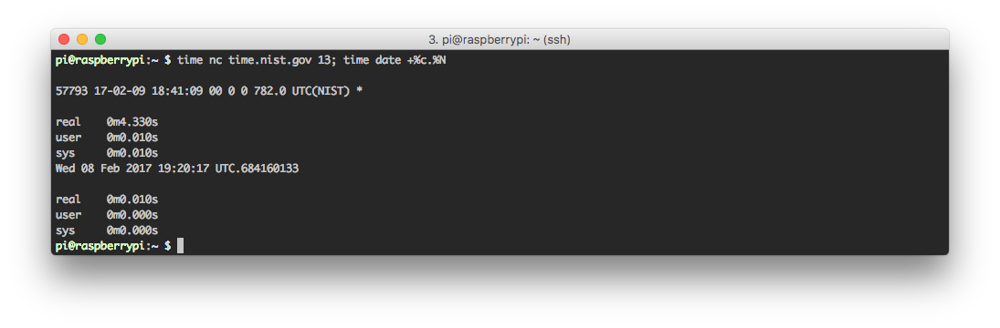
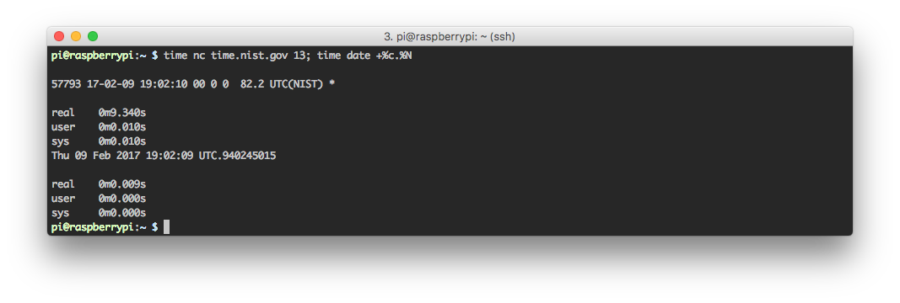
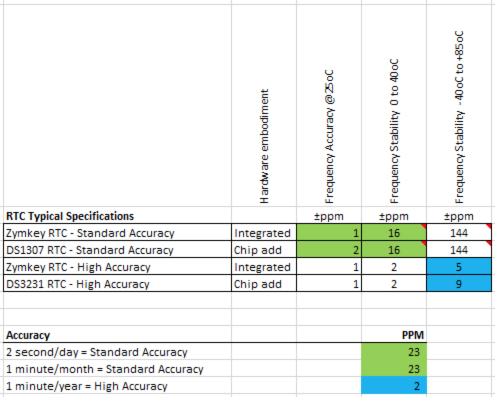

## Applicable Products

The information included in this post applies to [Zymkey 4](https://docs.zymbit.com/getting-started/zymkey4/), [HSM4](https://docs.zymbit.com/getting-started/hsm4/), and [HSM6](https://docs.zymbit.com/getting-started/hsm6/).

---

Standard Zymkey and HSMs are supplied with a Real Time Clock (RTC). This capability can be useful for platforms which do not have a built-in RTC, such as Raspberry Pi, but rather depend on NTP for time-keeping.

Dependence on NTP may cause problems due to unscheduled power outages or unreliable WiFi connections. For example, if a deployed application that periodically collects sensor data experiences a power outage and is not able to restore a connection to any available networks upon boot up, the timestamps associated with any collected data would be incorrect. On Raspberry Pi, this will be approximate to the last valid timestamp when things were last running normally.

We can simulate this by disabling `ntp.service` comparing the system date to the `time.nist.gov` server. After only 12 hours, the system clock has drifted nearly 40 minutes!

Zymkey and HSM’s Real Time Clock is battery backed for reliable operation, which could be very valuable for significant power or network outages. Prior to starting NTP in the boot sequence, the Zymkey or HSM provides the current UTC timestamp to the host computer (e.g. Raspberry Pi). This means that, if access to a reliable network isn’t available, a reliable timestamp will be available for use by any running applications.

With a bound Zymkey/ HSM installed and running `zkbootrtc.service ` on the same system as above (ntp disabled), we can see the clock restored based on the Zymkey/ HSM's RTC. You will notice this message at boot:

> Feb 8 19:22:26 raspberrypi systemd[1]: Starting Restore System Clock from Zymkey…
> Feb 9 18:58:48 raspberrypi systemd[1]: Started Restore System Clock from Zymkey.

And we can validate using the same test as above.

The time value is not settable directly by applications that are running on Pi. Instead RTC accuracy is monitored and maintained by the software suite.

In order for the RTC feature to be activated, the Zymkey/ HSM needs to have it’s clock checked and set occasionally, which is done by the HSM software, but this means that NTP must be running so that the Pi time is synchronized to an accurate clock source. To make sure that NTP is active, on later raspbian distributions, you’ll need to run `sudo timedatectl set-ntp true` and then reboot. In the case where a new coin cell has been installed, it may take a few minutes after the reboot for the HSM time to be synchronized.

## Accuracy of RTC

Zymkeys and HSMs with integrated RTC are supplied with Standard Accuracy calibration. This is generally suitable for commercial applications that are not exposed to extreme temperature ranges and not disconnected from NTP for months on end. (see specs below)

An optional High Accuracy RTC are available, providing additional stability over extended temperature ranges.

