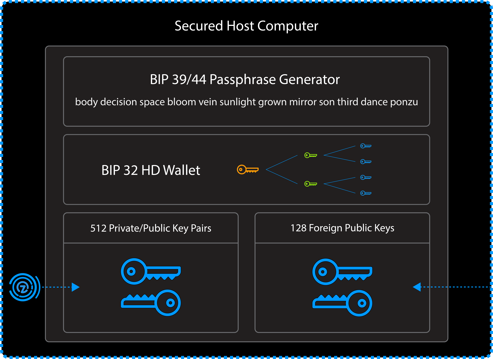

>All code snippets written in this article is written using python3.
For more zymbit api documentation (Python/C/C++) visit: [HSM6 API Documentation](https://docs.zymbit.com/api/api_docs_intro/)

## **What is a digital wallet?**
The digital wallet provided by the hsm6 is a BIP32/39/44 HD wallet, or Hierarchical Deterministic wallet. A HD wallet derives all new addresses/keys from a master seed, thus creating a hierarchical wallet structure. BIP32 is the first seed standard for HD wallets, while BIP39 is a standard that converts a mnemonic sentence (a sentence of random words) into a 512 bit seed. BIP44 allows for multiple accounts in the form of children derivations from the master seed.



## **Why use a digital wallet?**
To make digital transactions, a user needs to have a public/private key pair. The public key is an address used for receiving incoming goods, while the private key is used for sending those goods. Losing this key pair will be disastrous, as this will effectively give someone access to the assets in that key pair. This is why for additional security it's best practice to change addresses (keys) for every transaction. HD wallets automatically derive new addresses to use, thus eliminating the problem for the user to generate hundreds of keys on their own.

## **Managing your digital wallet and security awareness**
The master seed is where all new key pairs will be derived from. Each new child key pair is created based off a existing parent key pair in the wallet. If a child key pair ever becomes 'compromised', it can't be tracked up the parent nodes. However this does warrant security awareness, that it will compromise all children key pairs derived from the stolen key pair.

**For security reasons, the user is expected to keep track of all the key pairs via either the node address on the wallet or the slot it was allocated to on the hsm6.**
>It's better to lose a branch than a whole tree, so keep your master seed safe and locked away!

## **Using Digital Wallet:**
Example code snippet to show how to use digital wallet Zymbit API

```
#!/usr/bin/python3

import zymkey

#Create a master seed and return the bip39 mnemonic
master_key = bytearray("3xampleM@sterK3Y", 'utf-8')
wallet_name = "MyExampleWallet"
master_slot, bip39_mnemonic = zymkey.client.gen_wallet_master_seed("nistp256", master_key, wallet_name, True)
print("Master Slot:%s\nBip39 mnemonic (write this down!):\n%s" % (master_slot, bip39_mnemonic))

#Generate a child key from the master seed
child_slot = zymkey.client.gen_wallet_child_key(master_slot, 3, True)
child_pub_key = zymkey.client.get_public_key(child_slot)

print("Child Slot:%s\nChild Public Key:%s" % (child_slot, child_pub_key))

#Get node address of the child key slot
node_addr = zymkey.client.get_wallet_node_addr(child_slot)
print("Node address:'%s' Wallet Name:'%s' Master Slot:'%s'" % (node_addr[0], node_addr[1], node_addr[2]))

#Get the key slot of the child key using our previous master key slot and wallet name
key_slot = zymkey.client.get_wallet_key_slot(node_addr[0],"MyExampleWallet", master_slot)
print("Key Slot:%s" % (key_slot,))

#Remove the master seed
zymkey.client.remove_key(master_slot)

#Restore the master seed with our previous written down bip39 mnemonic!
restored_seed_slot = zymkey.client.restore_wallet_master_seed_from_bip39_mnemonic("nistp256", bytearray("3xampleM@sterK3Y", 'utf-8'), "MyExampleWallet", bip39_mnemonic)
print("Restored slot:%s" % (restored_seed_slot,))

#Clean up the example slots
zymkey.client.remove_key(master_slot)
zymkey.client.remove_key(child_slot)
```

## Creating a master seed (new wallet)
The hsm6 can have multiple master seeds be stored in its key store, allowing for management of a variety of keyrings to work with. Master seeds and its derivations are additionally backed by EC curve cryptography for an extra layer of encryption/security. The ec curves currently supported are nistp256, secp256r1, secp256k1. The bip39 mnemonic is a 24 word string that can be used to restore or recreate a previous generated master seed. Note that a wallet name is also unique! There can not be multiple wallets with the same name.

**Make sure to write the bip39 mnemonic and store it somewhere safe!**
**The master seed is the key to its kingdom, so don't give it out to just anybody!**

>`gen_wallet_master_seed(string ec_key_type, bytearray master_key, string wallet_name, bool return_bip39_str)`
>
>**Returns the allocated master seed slot and the bip39 mnemonic if the bool flag is set True**

```
#Create a master seed and return the bip39 mnemonic
master_key = bytearray("3xampleM@sterK3Y", 'utf-8')
wallet_name = "MyExampleWallet"
master_slot, bip39_mnemonic = zymkey.client.gen_wallet_master_seed("nistp256", master_key, wallet_name, True)
print("Master Slot:%s\nBip39 mnemonic (write this down!):\n%s" % (master_slot, bip39_mnemonic))
```

## Generating a child key
Children key pairs are generated from **both** the slot and index of another key pair. Bip32 has two possible derivations **hardened** and **non-hardened**. Non-hardened key pairs can be linked back to its parent key pair with just its public key. Hardened key pairs can not be linked back to its parent key. So for best security practices, it's advised to generate hardened key pairs wherever possible.

>`gen_wallet_child_key(int slot, int index, bool is_hardened)`
>
>**Returns allocated slot on success**

```
#Generate a child key from the master seed
child_slot = zymkey.client.gen_wallet_child_key(master_slot, 3, True)
child_pub_key = zymkey.client.get_public_key(child_slot)

print("Child Slot:%s\nChild Public Key:%s" % (child_slot, child_pub_key))
```

**Node Address:**
The index parameter in the above example will add a new number 3 to the node address string in the wallet. Apostrophes after the number denote hardened keys. Below is an example node address string.

```
m / 3' / 1' / 0' / 1 / 28
```

## Get a node address from a key slot
If the user knows the key slot, they can get the node index and wallet name with this function.

>`get_wallet_node_addr(int slot)`
>
>**Returns an array [node index string, wallet name, master seed slot number]**

```
#Get node address of the child key slot
node_addr = zymkey.client.get_wallet_node_addr(child_slot)
print("Node address:'%s' Wallet Name:'%s' Master Slot:'%s'" % (node_addr[0], node_addr[1], node_addr[2]))

```

## Get a key slot from a wallet node address
If the user knows the wallet node index string and either the master seed slot or the wallet name it belongs to, they can get the hsm6 key slot with this function. Both master seed slot and wallet name are optional arguments, but if neither are filled, then it will throw an exception.

>`get_wallet_key_slot(string node_index, string wallet_name, int master_slot)`
>
>**Returns the key slot on success**

```
#Get the key slot of the child key using our previous master key slot and wallet name
key_slot = zymkey.client.get_wallet_key_slot(node_addr[0],"MyExampleWallet", master_slot)
print("Key Slot:%s" % (key_slot,))

```

# Restore a wallet master seed from a BIP39 mnemonic
With the Bip39 mnemonic sentence, master private key, and wallet name of a previously generated master seed, a user can restore a lost master seed or make a copy of the master seed on a different device.
**Keep in mind that this only restores the master seed, the children nodes will have to be manually generated again.**
> `restore_wallet_master_seed_from_bip39_mnemonic(string ec_key_type, bytearray master_key, string wallet_name, string bip39_mnemonic)`
>
>**Returns the allocated key slot on success**

```
#Remove the master seed
zymkey.client.remove_key(master_slot)

#Restore the master seed with our previous written down bip39 mnemonic!
restored_seed_slot = zymkey.client.restore_wallet_master_seed_from_bip39_mnemonic("nistp256", bytearray("3xampleM@sterK3Y", 'utf-8'), "MyExampleWallet", bip39_mnemonic)
print("Restored slot:%s" % (restored_seed_slot,))
```
